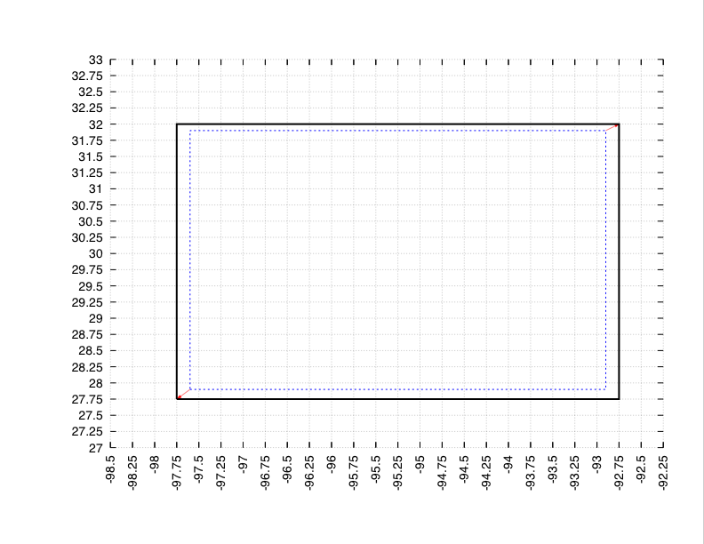
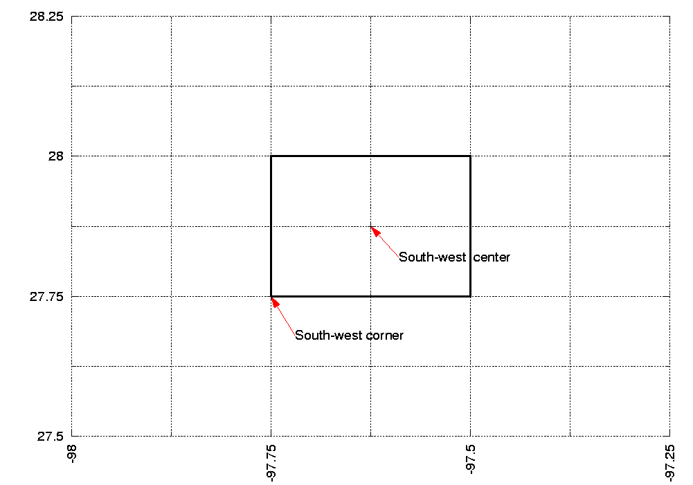
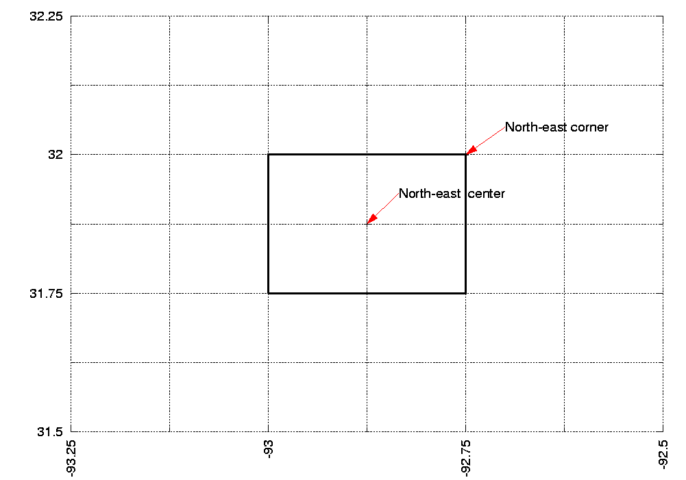

[[sec-d_latlon_example]]
== Cylindrical Lat/Lon Domain Example

This section describes how to compute the values for the run domain and/or the domain for a parameter or variable file on a cylindrical lat/lon projection.

First, the '`LIS-produced`' parameter data are defined on a Latitude/Longitude grid, from stem:[-180] to stem:[180] degrees longitude and from stem:[-60] to stem:[90] degrees latitude. Whereas most '`Native`' parameter datasets can extend down to stem:[-90] degrees latitude, accounting for glacial areas like Antarctica.

LDT is designed to bring a read-in parameter file directly to a common LIS-based domain grid, projection and resolution. Currently, the user can upscale or downscale from a given lat/lon projection to any other lat/lon projection but also lambert conformal and other projections.

For this example, consider reading in an older '`LIS-produced`' parameter file at 1/4 deg resolution. The coordinates of the south-west and the north-east points must be specified at the grid-cells' centers. Here the south-west grid-cell is given by the box stem:[(-180,-60), (-179.750,-59.750)]. The center of this box is stem:[(-179.875,-59.875)]. footnote:[Note, these coordinates are ordered (longitude, latitude).] Thus the `lower left lat:` is stem:[-59.875], and the `lower left lon:` is stem:[-179.875].

The north-east grid-cell is given by the box stem:[(179.750,89.750), (180,90)]. Its center is stem:[(179.875,89.875)]. Thus the `upper right lat:` is stem:[89.875], and the `upper right lon:` is stem:[179.875].

Setting the resolution (0.25 deg) gives `domain resolution dx:` is stem:[0.25] and `domain resolution dy:` is stem:[0.25].

Now let's consider setting the bounding coordinates for your desired LIS-based run domain.

If you wish to run over the whole domain defined by a parameter data domain then you simply set the values defined in the parameter domain section in the run domain section. For this example, this gives:

....
Run domain lower left lat:   -59.875
Run domain lower left lon:  -179.875
Run domain upper right lat:   89.875
Run domain upper right lon:  179.875
Run domain resolution dx:      0.25
Run domain resolution dy:      0.25
....

Just note that if you wish to run on a LIS run domain that happens to be greater (e.g. all of North America) than the extents of a read-in parameter file (e.g., STATSGO domain), then checks are in place for LDT to stop the running process.

Now say you wish to run LIS only over the region given by stem:[(-97.6,27.9), (-92.9,31.9)]. Since the running domain is a sub-set of the parameter domain, it is also a Latitude/Longitude domain at 1/4 deg. resolution. This gives `Run domain resolution dx:` is stem:[0.25] and `Run domain resolution dy:` is stem:[0.25]

Since the running domain must fit onto the parameter domain, the desired running region must be expanded from stem:[(-97.6,27.9), (-92.9,31.9)] to stem:[(-97.75,27.75), (-92.75,32.0)]. The south-west grid-cell for the running domain is the box stem:[(-97.75,27.75), (-97.5,28.0)]. Its center is stem:[(-97.625,27.875)]. This gives `Run domain lower left lat:` is stem:[27.875] and `Run domain lower left lon:` is stem:[-97.625].

The north-east grid-cell for the running domain is the box stem:[(-93,31.75), (-92.75,32.0)]. Its center is stem:[(-92.875,31.875)]. This gives `Run domain upper right lat:` is stem:[31.875] and `Run domain upper right lon:` is stem:[-92.875].

All together, the bounding coordinates for this sub-setted region are:

....
Run domain lower left lat:   27.875
Run domain lower left lon:  -97.625
Run domain upper right lat:  31.875
Run domain upper right lon: -92.875
Run domain resolution dx:     0.25
Run domain resolution dy:     0.25
....

Note, the LIS project has defined 5 km resolution to be 0.05 deg. and 1 km resolution to be 0.01 deg. If you wish to run at 5 km or 1 km resolution, redo the above example to compute the appropriate grid-cell values.

See Figure <<fig-snap_to_grid>> for an illustration of adjusting the running grid. See Figures <<fig-south_west>> and <<fig-north_east>> for an illustration of the south-west and north-east grid-cells.

[[fig-snap_to_grid,Snap to grid]]
.Illustration showing how to fit the desired running grid onto the actual grid

[[fig-south_west,South-west example]]
.Illustration showing the south-west grid-cell corresponding to the example in Section <<sec-d_latlon_example>>

[[fig-north_east,North-east example]]
.Illustration showing the north-east grid-cell corresponding to the example in Section <<sec-d_latlon_example>>

