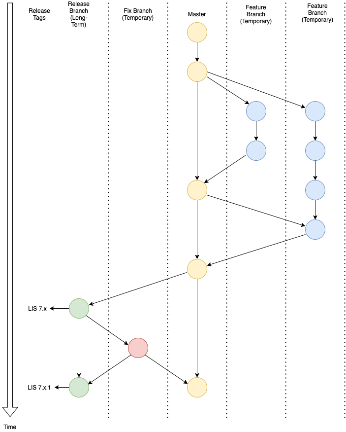
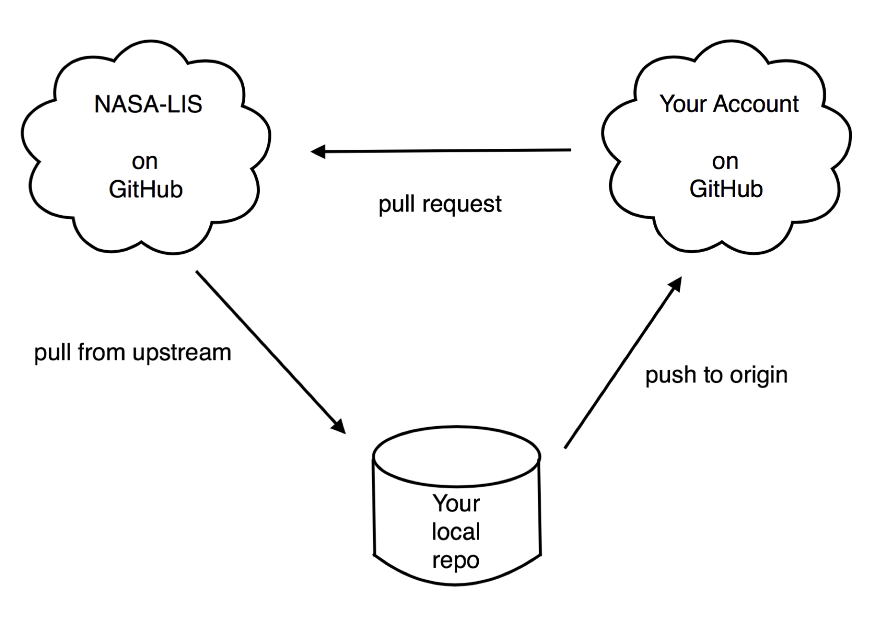
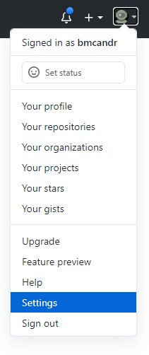
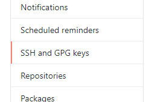
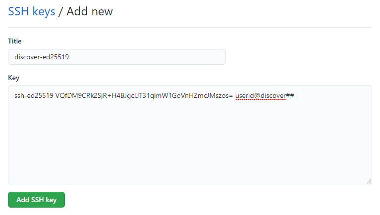
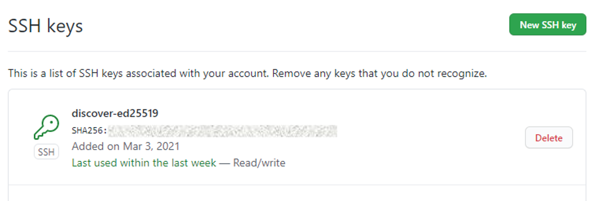

= Working with GitHub
:author: James Geiger
:revnumber: 14
:revdate: 3 Aug 2021
:sectnums:
:imagesdir: ./images

:github: https://github.com/
:github_training: https://www.youtube.com/githubguides
:github_hellowold: https://guides.github.com/activities/hello-world/
:nasalis: https://github.com/NASA-LIS/
:nasalis_test: https://github.com/NASA-LIS/lisf-test
:nasalis_ssh: github:NASA-LIS/
:lisf: LISF
:lisf_git: LISF.git
:lisf_test_git: lisf-test.git
:emdash: —

== General notes

=== Terminal session prompts

In the 'terminal sessions' below,

`%` represents the shell prompt.  This is a command that you enter.

`#` either represents a comment describing what is happening or represents, in a generic way, steps that you must perform.

For example,

....
% git checkout ...
# Carry out your work: edit, `git add`, `git commit`, etc.
% git push -u origin ...
....

=== Terminal session user-provided values

In the commands that follow, user-provided information is marked up with '<' and '>'.  Treat this like a fill-in-the-blank.  In the command `git add <file>`, you are expected to provide the name of the file that you are trying to add; e.g. `git add core/LIS_historyMod.F90`.

=== NASA-LIS/LISF test repository

//The correct URL for the NASA-LIS/LISF repository will be https://github.com/NASA-LIS/LISF.

//To facilitate hands-on participation (e.g., copy/paste), the URL will be replaced with https://github.com/NASA-LIS/lisf-test.

Lab members, feel free to use `{nasalis_ssh}{lisf_test_git}` (URL: {nasalis_test}) as a testbed to try out using git and GitHub for your LISF development.

Just replace `{nasalis_ssh}{lisf_git}` and `{lisf_git}` with `{nasalis_ssh}{lisf_test_git}` and `{lisf_test_git}`, respectively.

== First steps

=== RTFM — Review the fine material

link:{github:}[GitHub] has produced a simple "Hello World" guide at {github_hellowold}.

GitHub has produced a series of tutorials to introduce you to git and GitHub at {github_training} (see the _Get Up and Running_ playlist).  Please take some time to watch them.

The rest of this document assumes that you have some working knowledge of git by reading/watching the above material.

=== Register for an account on GitHub

Lab members, go to link:{github}[GitHub] and register for an account.

When registering, use your *NASA* email address.  For your username, please try to use your NASA AUID/discover username.  If that is not possible, then use your best judgment to pick a suitable username.

. I want to separate your government-funded work from your personal work.
. I want to easily manage your access to various GitHub features; I know your NASA email account, making it easy for me to find you.

== Workflow

The LISF core team came up with the following workflow for developing LISF in git:

//image::lis_workflow_crop.png[align=center,pdfwidth=75%,scaledwidth=75%]

== Working with GitHub

//:sectnums!: // disable section numbers

// Inspired by https://github.com/MarcDiethelm/contributing/blob/master/README.md
//and by https://akrabat.com/the-beginners-guide-to-contributing-to-a-github-project/

=== Circle of Life

Here is a simple cartoon to keep in mind while learning how to work with GitHub.

=== Step 0. Set up .gitconfig

In your home directory on your local system, create a file named .gitconfig containing this:

....
[core]
        pager = less -F -X -R
[push]
        default = simple
[user]
        email = <your-nasa-email-address>
        name = <Your Name>
....

=== Step 1. Set up SSH Access to GitHub
anchor:sec_step1[Step 1. Set up SSH access to GitHub ]

On link:https://github.blog/2020-12-15-token-authentication-requirements-for-git-operations/[August 13, 2021] GitHub disabled password authentication in favor of more secure alternatives: SSH keys and Personal Access Tokens. *All users* must use one of these options to continue to connect to GitHub using `git` (i.e., to clone, push, and pull). We recommend using link:https://www.ssh.com/ssh/protocol/#how-does-the-ssh-protocol-work[SSH keys] and describe how to set up and use them with `git` below.

IMPORTANT: This process must be completed on each computer you use to interact with GitHub via the command-line (personal computer, Discover, etc.).

==== Create a GitHub-specific SSH Key

. In the terminal, change directories into _~/.ssh_:
+
[subs="attributes+,-callouts"]
....
% cd ~/.ssh
....

. Think of a unique link:https://www.ssh.com/ssh/passphrase[passphrase] to pair with this SSH key. This phrase should be 15-20 characters in length and contain a mix of:
+
* Lowercase letters
* Uppercase letters
* Numbers
* Special characters (!, @, #, $, etc.)
+
For example: `L&Inform@ti0n$ystem`
+
To make a long passphrase easier to remember you can use a favorite book/song/movie title, idiom, or quote as the foundation and then modify a few characters to make it unique.
+
IMPORTANT: Please do not use the example above as your actual passphrase.

[start=3]
. Generate your unique SSH key:
+
[subs="attributes+,-callouts"]
....
% ssh-keygen -t ed25519 -f id_ed25519-github
....
+
Where,
+
--
* `-t ed25519` selects the ed25519 encryption algorithm.
* `-f id_ed25519-github` saves the public and private keys in files named _id_ed25519-github_. *Be sure to use the filename option or you risk overwriting an existing key!*
--
+
Enter the passphrase you created above at the two prompts that appear.
+
If the key was successfully created `ls` should show two new files: __id_ed25519-github__ and __id_ed25519-github.pub__. The file ending with _.pub_ contains your public key and the other file contains your private key.

. Print the contents of the _public_ key file:
+
[subs="attributes+,-callouts"]
....
% cat id_ed25519-github.pub
> ssh-ed25519 VQfDM9CRk2SjR+H4BJgcUT31qlmW1GoVnHZmcJMszos= userid@discover##
....
+
Copy the entire line beginning `ssh-ed25519`. This is your public key. _It will be unique from the example shown above._

. Open a browser window and navigate to link:https://github.com[GitHub]. Log in, if necessary, then navigate to your account Settings by clicking on your user icon in the top right:
+

+
From the Settings menu, click on "SSH and GPG Keys":
+

+
Click the green "New SSH Key" button in the top right to open the SSH key form.
+
In the box labeled "Title", add a descriptive label that indicates what machine uses this key to connect to GitHub (e.g., "discover-ed25519" or "work-laptop").
+
In the box labeled "Key", paste your public key.
+

+
Click "Add SSH key".
+
The new key should appear in your list of SSH keys:
+

. Tell `ssh` which key to use when connecting to GitHub.
+
Open _~/.ssh/config_ with a text editor and add the following:
+
[subs="attributes+,-callouts"]
....
Host github
  Hostname github.com
  User git
  IdentityFile ~/.ssh/id_ed25519-github
....
+
[NOTE]
====
If _~/.ssh/config_ is not empty, add a blank line between the previous section and the new text.

If you used a different filename for your SSH key, modify the path after `IdentityFile` to point to your key file.
====

. Test your SSH key by running the following command:
+
[subs="attributes+,-callouts"]
....
% ssh -T github
....
+
GitHub should respond with:
+
[subs="attributes+,-callouts"]
....
> Hi <your-user-name>! You've successfully authenticated, but GitHub does not provide shell access.
....

If successful, your SSH key is ready for use with GitHub. Remember to repeat the steps above on any other machines you use to connect to GitHub.

==== Set up SSH Agent to temporarily store your passphrase

When using SSH keys, `git` will ask for your passphrase every time you clone, push, or pull from GitHub. To enter your passphrase just once per session, add your private SSH key to the SSH agent. This is useful for sessions where you anticipate having to run `git pull` and `git push` numerous times.

Return to the terminal and start the SSH agent in the background:

[subs="attributes+,-callouts"]
....
% eval "$(ssh-agent -s)"
....

Add your _private_ key to the SSH agent:

[subs="attributes+,-callouts"]
....
% ssh-add ~/.ssh/id_ed25519-github
....

Enter your passphrase at the prompt.

NOTE: Unfortunately, the SSH agent does not store your private key between sessions (i.e., logins to Discover). The two commands above must therefore be run in any session where you want to avoid repeatedly typing your passphrase.

==== SSH URLs

Switching to SSH keys requires a small change in the way you use `git` to interact with GitHub.

Before the change to SSH, GitHub allowed the use of HTTPS URLs when cloning or adding remote repositories:

[subs="attributes+,-callouts"]
....
% git clone {nasalis}{lisf_git}
....

Now you will have to use SSH URLs which take the form `git@github.com:user/repository.git` by default. However, the additions made to your _~/.ssh/config_ file above allow you to simplify this to `github:user/repository.git`. For example:

[subs="attributes+,-callouts"]
....
# Cloning your LISF repository
% git clone github:<your-user-name>/{lisf_git}

...
# Adding a remote repository
% git remote add upstream {nasalis_ssh}{lisf_git}
....

===== Update existing repositories to use SSH URLs

Any existing local repositories must be updated to use SSH URLs before August 13, 2021.

. Change directories into an existing repository.

. View the list of remote repositories being tracked:
+
[subs="attributes+,-callouts"]
....
% git remote -v
> origin	{github}<your-user-name>/{lisf_git} (fetch)
> origin	{github}<your-user-name>/{lisf_git} (push)
> upstream	{nasalis}{lisf_git} (fetch)
> upstream	{nasalis}{lisf_git} (push)
....

[start=3]
. Set the URLs of each remotes to the SSH version:
+
[subs="attributes+,-callouts"]
....
% git remote set-url origin github:<your-user-name>/{lisf_git}
% git remote set-url upstream {nasalis_ssh}{lisf_git}
....

. Verify that the URLs have been correctly updated:
+
[subs="attributes+,-callouts"]
....
% git remote -v
> origin	github:<your-user-name>/{lisf_git} (fetch)
> origin	github:<your-user-name>/{lisf_git} (push)
> upstream	{nasalis_ssh}{lisf_git} (fetch)
> upstream	{nasalis_ssh}{lisf_git} (push)
....

=== Step 2. Create a clone of the NASA-LIS/LISF repository on GitHub into your GitHub work account
anchor:sec_step2[Step 2]

Go to {nasalis}{lisf}.  Click on the gray "Fork" button found at the top of the page.

This will create a clone of the NASA-LIS/LISF repository into your work account.

You should see

....
<your-user-name>/LISF
forked from NASA-LIS/LISF
....

at the top of your page.

[NOTE]
====
I see:

....
jvgeiger/LISF
forked from NASA-LIS/LISF
....
====

=== Step 3. Clone the repository in your GitHub work account onto your local machine
anchor:sec_step3[Step 3]

The correct path to use may be obtained by clicking on the green "Clone or download" button.

On your local machine run:

[subs="attributes+,-callouts"]
....
% git clone github:<your-user-name>/{lisf_git} <dir>
....

Your local clone refers to your GitHub work account as 'origin'.

[NOTE]
====
I would run:

[subs="attributes+,-callouts"]
....
% git clone github:jvgeiger/{lisf_git}
....
====

=== Step 4. Add the NASA-LIS/LISF repository as a remote called 'upstream'.
anchor:sec_step4[Step 4]

You will routinely pull commits from the NASA-LIS/LISF repository (pull from upstream) into your local repository.  To set this up, go into your local LISF working directory and run:

[subs="attributes+,-callouts"]
....
% git remote add upstream {nasalis_ssh}{lisf_git}
....

Now your local clone refers to the official NASA-LIS/LISF repository as 'upstream'.

=== Step 5. Carry out your work

This is the step in which you will be developing LISF, either by working on a new feature or by fixing a bug.  But first here is some introductory information, which will become clearer below.

==== Branching

All branch names will follow this naming convention:
....
<prefix>/<name>
....

where <prefix> is

* feature/ — used by developers for new work
* fix/ — used by developers for bug fixes
* support/ — used by reviewers for creating release/support branches; e.g.:
** support/public-release-7.3
** support/557ww-release-7.3

These prefixes will help provide context as well as aid in sorting.

IMPORTANT: No work occurs directly on your 'master' branch.

==== Issues

New features and bug fixes (yes, even simple fixes) should begin by creating an Issue on GitHub.

. This is how we communicate new work and/or issues amongst the team.
. What seems like a simple bug fix can actually be quite involved.
. What seems like a simple bug fix can break existing behaviour.

Having a ticket in place before working on and submitting a pull request gives the team a place to discuss any potential issues with the Issue.

==== Type of work

The details of this step depend on what type of work that you are doing; in particular, adding a new feature (<<sec_step5a>>) or fixing a bug (<<sec_step5b>>).

IMPORTANT: Steps 5A and 5B assume that you are in your local working directory.

==== Step 5A. Adding a new feature
anchor:sec_step5a[Step 5A. Adding a new feature]
These are the steps for adding a new feature, such as a new obs reader, or for enhancing an existing component, such as adding soil moisture da support to an LSM.

==== Step 5A.1. Branch for feature development

When beginning new work, always create a new branch off 'master' to work on.

First, make sure that you are on your 'master' branch:

....
% git checkout master
....

Next, update your 'master' with respect to NASA-LIS/LISF ('upstream') and keep your GitHub account ('origin') up-to-date:

....
% git pull upstream master
% git push origin master
....

Finally, create a local branch to work on:

....
% git checkout -b <feature/branch>
....

[NOTE]
====
For example, say you are incorporating NoahMP 6.5 into LIS.  You would create a branch like:

....
% git checkout -b feature/noahmp-6.5
....
====

==== Step 5A.2. Work work work
anchor:sec_work[Step 5A.2]
You are now working on your own branch in your local working directory to perform your software development, using commands like `git add` and `git commit` to track your changes.

In addition to writing code, please update relevant documentation and prepare a testcase for your work.

Please see
https://chris.beams.io/posts/git-commit/
for guidance on writing a good commit message.

Good commit messages supplement documentation and provide context about your work to both the LIS team and the LIS community.

==== Step 5A.3. Push your branch to 'origin'

When done, push your branch in your local repository to your GitHub work account (i.e., push to origin).

....
% git push -u origin <feature/branch>
....

[NOTE]
====
Continuing with the example, you would execute:

....
% git push -u origin feature/noahmp-6.5
....
====

===== Feature development summary

[subs="attributes+,-callouts"]
....
# Fork NASA-LIS/LISF — this is a one-time step
% git clone github:<your-user-name>/{lisf_git} <dir>
% cd <dir>
% git remote add upstream {nasalis_ssh}{lisf_git}
% git checkout master
% git pull upstream master
% git push origin master
% git checkout -b <feature/branch>
# Carry out your work: edit, document, test, `git add`, `git commit`, etc.
% git push -u origin <feature/branch>
....

==== Step 5B. Fixing a bug
anchor:sec_step5b[Step 5B. Fixing a bug]
These are the steps for fixing a bug in LISF.

==== Step 5B.1. Branch for fixes

Bug fixes should occur on the latest supported release branch, upstream/<support/branch>.

[NOTE]
====
We will actively maintain:

* the most recent public release, along with
* any operational releases, like the 557WW releases
====

If this is your first time working with upstream/<support/branch> (or you removed that tracking branch), then

....
% git fetch upstream <support/branch>
% git checkout -b <support/branch> upstream/<support/branch>
....

Otherwise,
....
% git checkout <support/branch>
% git pull upstream <support/branch>
....

Then create a branch to work the fix on.

....
% git checkout -b <fix/branch> <support/branch>
....

[NOTE]
====
Let's say that the actively maintained support branch is support/release-7.5.  And let's say that you opened Issue #123 to track this bug.

For my first time, I would run:

....
% git fetch upstream support/release-7.5
% git checkout -b support/release-7.5 upstream/support/release-7.5
% git checkout -b fix/123 support/release-7.5
....

If I already have a support/release-7.5 branch tracking upstream, then I would run:

....
% git checkout support/release-7.5
% git pull upstream support/release-7.5
% git checkout -b fix/123 support/release-7.5
....
====

NOTE: If the bug exists in the 'master' branch only (i.e., the bug is in code that has not yet been released), then branch off 'master'.

==== Step 5B.2. Work work work

Please see <<sec_work>>.

==== Step 5B.3. Push your branch to 'origin'

When done, push your branch in your local repository to your GitHub work account (i.e., push to origin).

....
% git push -u origin <fix/branch>
....

[NOTE]
====
Continuing with the example, you would execute:

....
% git push -u origin fix/123
....
====

===== Bug fix summary

.First time for upstream/<support/branch>
[subs="attributes+,-callouts"]
....
# Fork NASA-LIS/LISF — this is a one-time step
% git clone github:<your-user-name>/{lisf_git} <dir>
% cd <dir>
% git remote add upstream {nasalis_ssh}{lisf_git}
% git checkout master
% git pull upstream master
% git push origin master
% git fetch upstream <support/branch>
% git checkout -b <support/branch> upstream/<support/branch>
% git checkout -b <fix/branch> <support/branch>
# Carry out your work: edit, document, test, `git add`, `git commit`, etc.
% git push -u origin <fix/branch>
....

.Second time for upstream/<support/branch>
[subs="attributes+,-callouts"]
....
# Fork NASA-LIS/LISF — this is a one-time step
% git clone github:<your-user-name>/{lisf_git} <dir>
% cd <dir>
% git remote add upstream {nasalis_ssh}{lisf_git}
% git checkout master
% git pull upstream master
% git push origin master
% git checkout <support/branch>
% git pull upstream <support/branch>
% git checkout -b <fix/branch> <support/branch>
# Carry out your work: edit, document, test, `git add`, `git commit`, etc.
% git push -u origin <fix/branch>
....

=== Step 6. Issue a pull request

Go to your GitHub work account.  Click on the green "Compare & pull request" button next to the branch that you want merged back into NASA-LIS/LISF.

IMPORTANT: Please make sure that you base the pull request onto the correct NASA-LIS/LISF branch: 'master' for a new feature; 'support/?' for a bug fix.

When submitting a pull request, you will see (following our bug fix example):

....
base fork: NASA-LIS/LISF base: support/release-7.5 head fork: <your-user-name>/LISF compare: fix/123
....

Fill in the form and click the green "Create pull request" button.  Please provide the material for a ChangeLog entry in the comment section of the pull request.  (The expected format will be provided later.)

NOTE: Submitting a pull request causes GitHub to jump to the NASA-LIS/LISF page.

Your pull request will be reviewed for code quality, proper documentation, and relevant testcase.

Sujay, Eric, David, or Jim will review code and documentation.  Testing will be performed.  (Reviewers please do not merge your own pull requests.)  This process may require some additional commits from you to resolve any issues that arise from the pull request review.

When addressing issues raised by a reviewer, simply push your new updates back to origin:

....
% git push origin
....

Your new updates will automatically show up in the pull request.

IMPORTANT: Reviewers make sure that the pull request is based onto the correct NASA-LIS/LISF branch: 'master' for a new feature; 'support/?' for a bug fix.

When reviewing a pull request, a reviewer will see:

....
<some-user-name> wants to merge 1 commit into NASA-LIS:support/release-7.5 from <some-user-name>:fix/123
....

==== Pull request summary

....
# Click "Compare & pull request"
# Verify the NASA-LIS/LISF base
# Fill in form and click "Create pull request"
# Address any concerns raised by the reviewers
% git push origin # if necessary
....

==== Pull request with conflict

When creating a pull request that will lead to a conflict, GitHub will warn you with this message:

....
Can’t automatically merge. Don’t worry, you can still create the pull request.
....

Please *don't*.  Please fix the problem.

.Resolving a conflict with a feature branch
....
% git checkout master
% git pull upstream master
% git push origin master
% git checkout <feature/branch>
% git merge master
# Resolve conflicts, `git add`, `git commit`, etc.
% git add <files>
% git commit
% git push origin
....

Then go back to your GitHub work account and create the pull request.

If you do create a pull request with a conflict in it, the reviewer will see a similar message:

....
This branch has conflicts that must be resolved
....

Reviewers, *don't*.  Contact the developer to fix the conflicts.

=== Step 7. Clean up

WARNING: Wait until your pull request has been accepted and merged before you run these steps.  If you clean up before your pull request has been merged, then you may lose work.

After the pull request is merged back into the NASA-LIS/LISF repository, you should pull the commits from NASA-LIS/LISF (i.e., pull from upstream) to your local repository.  You may then delete your feature or bug-fix branch.

==== Cleaning up a feature branch

....
% git checkout master
% git pull upstream master
% git push origin master
% git push origin -d <feature/branch>
% git branch -d <feature/branch>
....

==== Cleaning up a bug fix branch

....
% git checkout <support/branch>
% git pull upstream <support/branch>
% git push origin <support/branch>
% git push origin -d <fix/branch>
% git branch -d <fix/branch>
....

//:sectnums: // re-enable section numbers

== Collaborating with others

This section will outline the steps to follow when two developers need to work together to implement a feature or bug fix.

Say that both Alice and Bob are working together to incorporate Noah 6 into LISF.  Both have already performed <<sec_step1>>, <<sec_step2>>, <<sec_step3>>, and <<sec_step4>> to set up their GitHub account forks and local clones of LISF.

Alice will initiate the work.  See <<sec_step5a>>.

NOTE: The `git remote add` commands below are one-time operations, meaning you add a remote repository into your working repository only one time.

=== Alice begins and shares her work

.Alice performs:
....
% git checkout master
% git pull upstream master
% git push origin master
% git checkout -b <feature/noah6>
# Carry out her work: edit, `git add`, `git commit`, etc.
% git push -u origin <feature/noah6>
....

Alice has now made her working branch available for Bob to see.

=== Bob gets Alice's work

.Bob performs:
[subs="attributes+,-callouts"]
....
% git remote add alice github:alice/{lisf_git}
% git fetch alice <feature/noah6>
% git checkout -b <feature/noah6> alice/<feature/noah6>
# Carry out his work: edit, `git add`, `git commit`, etc.
% git push -u origin <feature/noah6>
....

Bob now has his own working branch based on Alice's, and he has made his working branch available for Alice to see.

=== Alice gets Bob's updates
anchor:sec_alice_gets_bobs[Alice gets Bob's updates]

.Alice performs:
[subs="attributes+,-callouts"]
....
% git remote add bob github:bob/{lisf_git}
% git fetch bob <feature/noah6>
% git checkout <feature/noah6>
% git merge bob/<feature/noah6>
# Review Bob's work
# Carry out her work: edit, `git add`, `git commit`, etc.
% git push origin
....

Alice now has a copy of Bob's working branch, and she has merged his updates into her own working branch.

=== Bob gets Alice's updates

.Bob performs:
[subs="attributes+,-callouts"]
....
% git fetch alice <feature/noah6>
% git checkout <feature/noah6>
% git merge alice/<feature/noah6>
# Review Alice's work
# Carry out his work: edit, `git add`, `git commit`, etc.
% git push origin
....

Bob has merged Alice's updates into his own working branch.

=== Repeat until done.

Alice and Bob repeat getting each other's updates until the work is done.  Since Alice began the work, she should wrap it up.  First, she should ensure that she has all Bob's updates by performing the steps in <<sec_alice_gets_bobs>> one last time (namely, `git fetch bob <feature/noah6>`, `git checkout bob <feature/noah6>`, `git merge bob/<feature/noah6>`, and `git push origin`).  Now Alice can submit a pull request.  And once accepted and merged, both Alice and Bob can clean up their local repositories.

== Dealing with multiple branches

We all support multiple projects or at least one project with multiple concerns.  This will result in you needing multiple branches to carry out your work.  `git` can manage multiple branches with no problem.  Here are two strategies for managing multiple branches.

NOTE: The commands found below are illustrative only.  Please read all the above steps in this document to properly work with git and GitHub for LISF development.

=== One clone per project

//First, I do not recommend a true all-in-one approach, where every project and all branches are contained within one local repository.  That is just too much to keep track of.

In a one clone per project approach, you will clone from your GitHub account once per project.  For example, say you are supporting both the NLDAS project and the FAME project.  You should:

[subs="attributes+,-callouts"]
....
% git clone github:<your-user-name>/{lisf_git} NLDAS
% git clone github:<your-user-name>/{lisf_git} FAME
....

Now let's say that for the NLDAS project you are 1) updating the NLDAS reader to support the new 5km domain and 2) incorporating VIC 8.  And for the FAME project, you are 1) adding the z-score metric to LVT and 2) adding the new XYZ soil moisture observation reader to LIS.  Then you would have:

.In NLDAS
....
% git branch

feature/nldas-5km-domain
feature/vic-8
....

.In FAME
....
% git branch

feature/z-score
feature/xyz-sm-obs
....

Here you switch projects using the Unix `cd` command:

....
% cd /discover/nobackup/<your-user-name>/NLDAS
# or
% cd /discover/nobackup/<your-user-name>/FAME
....

Then inside the NLDAS working repository, you switch branches using `git` commands:

....
% git checkout feature/nldas-5km-domain
# Carry out your work: edit, `git add`, `git commit`, etc.
% git checkout feature/vic-8
# Carry out your work: edit, `git add`, `git commit`, etc.
....

One problem with this approach is that developing (in particular, building) LISF was not designed with this in mind.  So switching branches within your local repository will most likely require fully recompiling LISF.  Another problem is that you must take care when running your work.  It is very easy to have, say, the feature/vic-8 branch checked out and compiled, but you are trying to run an nldas-5km-domain run.  However, it does give you a nicely organized working environment.

=== One clone per branch

NOTE: This is the recommended approach for dealing with multiple branches.

In this approach, you will clone from your GitHub account for each concern (feature, etc.) that you need to work on.  Using the projects and branches from above, you would:

[subs="attributes+,-callouts"]
....
% git clone github:<your-user-name>/{lisf_git} NLDAS-5km-domain/SRC
% git clone github:<your-user-name>/{lisf_git} NLDAS-vic-8/SRC
% git clone github:<your-user-name>/{lisf_git} FAME-z-score/SRC
% git clone github:<your-user-name>/{lisf_git} FAME-xyz-sm-obs/SRC
....

In each of these clones, you would have:

.In NLDAS-5km-domain/SRC
....
% git branch

feature/nldas-5km-domain
....

.In NLDAS-vic-8/SRC
....
% git branch

feature/vic-8
....

.In FAME-z-score/SRC
....
% git branch

feature/z-score
....

.In FAME-xyz-sm-obs/SRC
....
% git branch

feature/xyz-sm-obs
....

NOTE: Yes, you still make branches inside each working repository because no work should happen on the 'master' branch.

One problem with this approach is that it is messier in the sense that you now have many clones/directories of LISF on your local computer.  On the other hand, it is better organized in the sense that it allows you to keep the source code for a feature together with its testing data.  For example,

[subs="attributes+,-callouts"]
....
% mkdir NLDAS-5km-domain
% cd NLDAS-5km-domain
% mkdir TESTING
# populate TESTING with 5km input and output data
% git clone github:<your-user-name>/{lisf_git} SRC
# work in SRC
# test in TESTING
....

Also, it is simpler in that switching branches involves just the Unix `cd` command.  And `cd` 'ing into another branch does not require recompiling your source.

== Including a private repository

//* By default, private repos in an organization are unforkable
//* Enable forking for organization: https://help.github.com/articles/allowing-people-to-fork-private-repositories-in-your-organization/
//* Add users as collaborators to specific private repositories.

Some work within LISF may not be redistributed to others either because of contractual agreement or because a collaborator wishes to be the sole distributor of his source code.  Whatever the reason, you may need to work with a component that has been segregated into a private repository.

You do not have access to any private repositories within the NASA-LIS organization.  You must first have a need to use some restricted-access code and then ask for read-permission to that private repository.

=== Step 1. Create a clone of the NASA-LIS/<private-repo> repository on GitHub into your GitHub work account

Go to {nasalis} and select the desired privated repository.  Then click on the "Fork" button.

=== Step 2. Clone the private repository in your GitHub work account onto your local machine

NOTE: These instructions assume that you have already cloned LISF from your GitHub working account.

In your local working repository, go into the RESTRICTED sub-directory and clone the private repository from your GitHub work account.

....
% cd RESTRICTED
% git clone github:<your-user-name>/<private-repo> <dir>
....

The specific command will, of course, depend on which restricted-accesss component you need to work with.

=== Step 3. Add the NASA-LIS/<private-repo> as a remote called 'upstream'

Go into your RESTRICTED/<private-repo-dir> sub-directory, and run:

....
% git remote add upstream github:NASA-LIS/<private-repo>
....

Again, the specific command will depend on which private repository you need to work with.

=== Step 4. Carry out your work

Now you have a repository (for the restricted-access component) within a repository (for LISF).  To carry out your work for the restricted-access component, follow the instructions in <<sec_step5a>> and/or <<sec_step5b>>.

Yes, you may have two sets of commits and two sets of pull requests for your work.

[WARNING]
====

In general, do not run `git add --all`; this always ends up adding files to your commit that do not belong.  (See Section <<Explicitly add files>>.)  And, in particular, do not run `git add --all` when working with private/restricted repositories.  If you accidentally do, then you will see the following warning.  Follow the hint for running `git rm`.

.Accidental `git add --all`
....
% git add --all -n
add 'plugins/LIS_lsm_pluginMod.F90'
warning: adding embedded git repository: RESTRICTED/restricted-ua-lsm
hint: You've added another git repository inside your current repository.
hint: Clones of the outer repository will not contain the contents of
hint: the embedded repository and will not know how to obtain it.
hint: If you meant to add a submodule, use:
hint:
hint: 	git submodule add <url> RESTRICTED/restricted-ua-lsm
hint:
hint: If you added this path by mistake, you can remove it from the
hint: index with:
hint:
hint: 	git rm --cached RESTRICTED/restricted-ua-lsm
hint:
hint: See "git help submodule" for more information.
add 'RESTRICTED/restricted-ua-lsm/'
....
====

== Explicitly add files

Do not run commands like `git add .` or `git add --all`.  These commands will add files to your commit that do not belong.  For example, you may end up adding restricted code, backup files, temporary build scripts, and executables {emdash} files that do not belong in the repository.

Add files to a commit explicitly.  For example, you added a new output variable to NoahMP 4.0.1:

....
% git add core/LIS_histDataMod.F90 surfacemodels/land/noahmp.4.0.1/NoahMP401_main.F90
....

See `git help add` for more information about adding files to a commit.

== Useful commands

....
% git status
% git remote show origin
% git remote show upstream
% git remote prune upstream
....

== Creating a release

NOTE: This section is for reviewers.

//See https://github.com/git/git/blob/1d4361b0f344188ab5eec6dcea01f61a3a3a1670/Documentation/RelNotes/2.19.0.txt for inspiration.

These are the steps that a reviewer must follow to create a new LISF release.

IMPORTANT: Creating releases should be done from a clone of NASA-LIS/LISF, not from a clone of your GitHub work account.

In your local clone of NASA-LIS/LISF:

.Creating a point release
....
% git checkout master
% git pull origin master
% git checkout -b support/release-7.5
% git pull origin support/release-7.5
# perform final steps: update ChangeLog, docs, etc.; `git add`, `git commit`, etc.
% git tag -a v7.5.2 -m "Public Release 7.5.2"
% git push origin support/release-7.5
% git push origin v7.5.2
....

.Creating a new release
....
% git checkout master
% git pull origin master
% git checkout -b support/release-7.7
# perform final steps: update ChangeLog, docs, etc.; `git add`, `git commit`, etc.
% git tag -a v7.7 -m "Public Release 7.7"
% git push origin support/release-7.7
% git push origin v7.7
....

NOTE: Pushing a tag automatically adds an entry under releases on GitHub.

Then in the NASA-LIS/LISF repository on GitHub, click on "releases".  Click on the newly pushed tag, here v7.5.2; click "Edit tag"; fill in "Release title", here LISF Public Release 7.5.2; fill in "Describe this release", here "This is LISF public release 7.5.2"; and click the green "Publish release" button.

Of course, please elaborate in the description field for the release.

// This does NOT create an annotated tag.
// ....
// % git checkout master
// % git pull origin master
// % git checkout -b support/release-7.4
// % git push origin support/release-7.4
// ....
//
// Then in the NASA-LIS/LISF repository on GitHub, click on "releases".  Click on the "Draft a new release" button.  Fill in "Tag version", here v7.4; select "Target branch", here support/release-7.4; fill in "Release title", here v7.4;
// fill in "Describe this release", here "LISF public release 7.4"; and click the green "Publish release" button.

Finally merge release-related updates back into master.  In your local clone:

....
% git checkout master
% git pull origin master
% git merge --no-ff support/release-7.5
% git push origin master
....

//== Labels for issues
//
//WARNING: Work in progress
//
//* project/LDT
//* project/LIS
//* project/LVT
//* ---
//* project/AFWA
//* project/AIST
//* project/CRREL
//* project/FAME
//* project/FEWSNET
//* project/GLDAS
//* project/JHU
//* project/WRF_Hydro
//* project/NCA
//* project/NLDAS
//* project/NOHRSC
//* project/NUWRF
//* project/SPoRT
//* project/WRF-SCM
//* project/SERVIR
//* project/HMA
//* project/LIS-routing
//* project/SUSMAP
//* project/WWAO
//* project/THP-snow-osse

//== Note regarding testing
//
//WARNING: Review.  Do not include in the tutorial.
//
//Consider
//
//....
//
//     master   feature
//       |
//       |
//       C1
//       |
//       |
//       C2
//       |
//       |
//       C3 ---
//       |     \
//       |      \
//       C4      |
//       |       F1
//       |       |
//       |       |
//       |       F2
//       |       |
//       C5      |
//       |       F3
//       |       |
//       |       |
//       |       F4    <-- pull request
//       |       |
//       |      /
//       V     /
//       C6 <--
//
//....
//
//Here when the pull request is made, the master branch has moved forward by two commits.  When Bob tests the feature branch, he misses the impact of commits C4 and C5 on the feature branch.
//
//One solution is to have the developer rebase his work onto the latest commit of master (C5 in this example).  I *do not* recommend this solution.  I consider `git rebase` to be an advanced command and not appropriate for our developers.
//
//I believe that Bob should first test the feature branch (C3 -> F1 -> ... -> F4).  Here he can verify that he is able to reproduce the testing that the developer did.  And this should facilitate any back-and-forth interaction between Bob and the developer.  After Bob completes this test, he should locally merge the feature branch into master, creating commit C6.  Then he should test C6.  This will determine whether commits C4 and C5 and the feature branch are compatible.  After Bob passes this test, then a reviewer merges the pull request into NASA-LIS/LISF.
//
//However, Bob must be brought up to speed with git and GitHub.  So, initially, I will be happy with Bob simply testing the feature branch.  The merge commit, C6, will get testing as part of the weekly automated testing.
//
//I suspect that, in general, commits like C4 and C5 will be compatible with the feature branch, meaning that commit C6 will be good and not need immediate testing.   I suspect that we can leave testing of the merge commits until the weekly automated testing.
